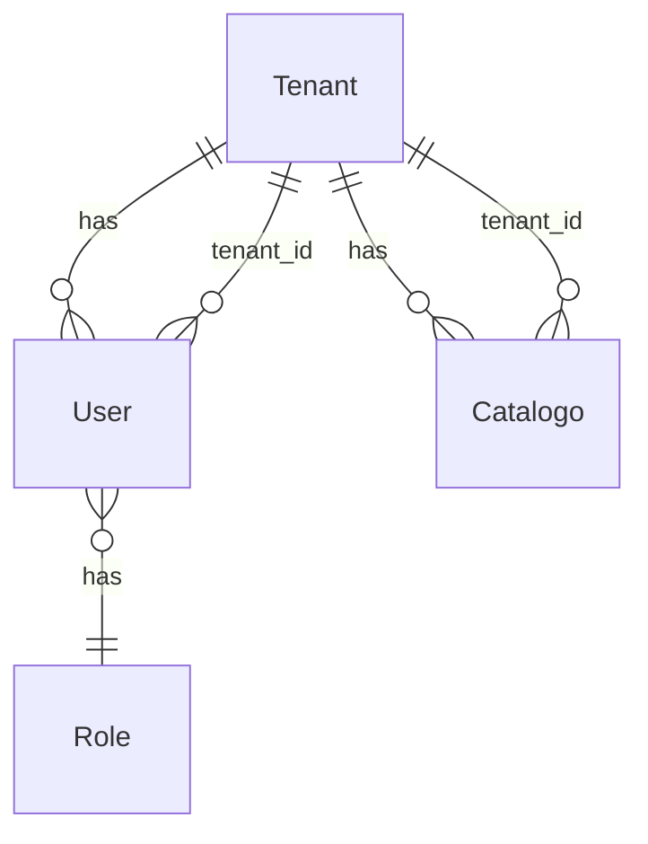

# Database — Academy Backend

This document describes the recommended database schema for the Academy backend. Use it to create migrations and entities (e.g. TypeORM).

## Entities and relationships

- **Tenant:** One per company/organization (multi-tenant).
- **User:** Links to Clerk (`clerk_user_id`). Belongs to one tenant; has one role.
- **Role:** Denormalized or from a small table (e.g. `admin`, `manager`, `viewer`).
- **Catalogo:** One per uploaded PDF. Belongs to a tenant; has name, sector, file reference, timestamps.

## Tables (snake_case)

### tenants

| Column     | Type         | Notes                    |
|-----------|--------------|---------------------------|
| id        | UUID (PK)    |                          |
| name      | VARCHAR(255)| Company/organization name |
| created_at| TIMESTAMPTZ |                          |
| updated_at| TIMESTAMPTZ |                          |

### users

| Column          | Type         | Notes                          |
|-----------------|--------------|--------------------------------|
| id              | UUID (PK)    |                                |
| tenant_id       | UUID (FK)    | → tenants.id                   |
| clerk_user_id   | VARCHAR(255) | Clerk user ID (unique per app)  |
| role            | VARCHAR(50)  | e.g. admin, manager, viewer    |
| created_at      | TIMESTAMPTZ  |                                |
| updated_at      | TIMESTAMPTZ  |                                |

- Unique constraint: `(tenant_id, clerk_user_id)`.
- Index: `tenant_id`, `clerk_user_id`.

### catalogos

| Column     | Type          | Notes                          |
|------------|---------------|--------------------------------|
| id         | UUID (PK)     |                                |
| tenant_id  | UUID (FK)     | → tenants.id                   |
| name       | VARCHAR(255)  | Display name                   |
| sector     | VARCHAR(100)  | Optional sector                |
| file_name  | VARCHAR(255)  | Original filename               |
| file_path  | VARCHAR(512)  | Or storage key / URL           |
| mime_type  | VARCHAR(100)  | e.g. application/pdf           |
| created_at | TIMESTAMPTZ   |                                |
| updated_at | TIMESTAMPTZ   |                                |

- Index: `tenant_id`, `(tenant_id, sector)` if filtering by sector.

## Migration order

1. Create `tenants` table.
2. Create `users` table (with `tenant_id` FK).
3. Create `catalogos` table (with `tenant_id` FK).

## Multi-tenancy in queries

- Every SELECT/INSERT/UPDATE for catalogos must be scoped by `tenant_id`.
- Resolve `tenant_id` from the authenticated user (JWT claim or lookup by `clerk_user_id` in `users`).

## File storage

- Do not store file binary in the database. Store a path, key, or URL (e.g. S3 key or CDN URL) in `catalogos.file_path` or equivalent; serve downloads via signed URLs or a dedicated download endpoint.
